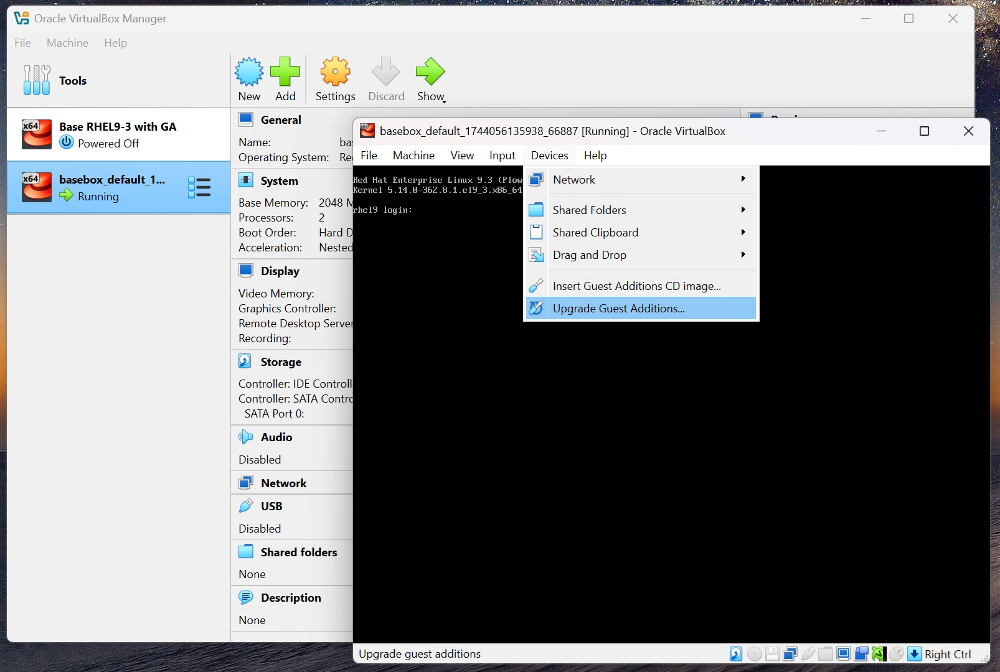

# VirtualBox RHEL9 Base Box

RHEL9 vagrant base box for VirtualBox.


- Documentation: [https://developer.hashicorp.com/vagrant/docs](https://developer.hashicorp.com/vagrant/docs)

- Public Boxes: [https://portal.cloud.hashicorp.com/vagrant/discover](https://portal.cloud.hashicorp.com/vagrant/discover)

Leverages [generic/rhel9](https://portal.cloud.hashicorp.com/vagrant/discover/generic/rhel9) with a few minor customizations

## Usage

### Launch the box

`vagrant up`

### Upgrade Guest Additions

Open the VirtualBox Manager GUI, "Show" the basebox vm, upgrade the guest additions and restart the vm.



### Packaging the box

`vagrant package --base <box name> --info info.json --output base.box`

Find the vm name using `vboxmanage list vms`

### Add the base box 

`vagrant box add metadata.json`

Confirm the addition with `vagrant box list`

```
PS C:\vagrant\basebox> vagrant box list
generic/rhel9     (virtualbox, 4.3.12, (amd64))
mapickett77/rhel9 (virtualbox, 0.0.1, (amd64))
```


